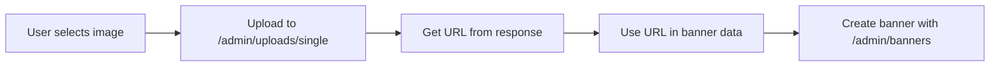

# 🎨 Frontend Banner Management - Complete Implementation Guide

## 📋 Table of Contents

1. [Overview](#overview)
2. [API Endpoints](#api-endpoints)
3. [Banner Data Structure](#banner-data-structure)
4. [Image Upload Process](#image-upload-process)
5. [Complete Implementation](#complete-implementation)
6. [Testing](#testing)

---

## Overview

**Critical:** Banner creation is a **2-step process**:

1. ✅ **Upload image** → Get URL
2. ✅ **Create banner** with image URL

You **cannot** send image files directly to the banner creation endpoint. You must upload images first and use the returned URLs.

---

## API Endpoints

### 1. Upload Image

```http
POST /api/v1/admin/uploads/single
Authorization: Bearer {token}
Content-Type: multipart/form-data
```

**Request Body:**

```
file: [Image File]
```

**Response:**

```json
{
    "success": true,
    "data": {
        "filename": "file-1762923295589-673851855.png",
        "originalName": "banner.png",
        "mimetype": "image/png",
        "size": 245678,
        "url": "/uploads/temp/file-1762923295589-673851855.png",
        "path": "S:\\...\\backend\\uploads\\temp\\file-1762923295589-673851855.png"
    },
    "message": "File uploaded successfully"
}
```

**Important:** Use `data.url` for the banner `image` field.

---

### 2. Create Banner

```http
POST /api/v1/admin/banners
Authorization: Bearer {token}
Content-Type: application/json
```

**Request Body:**

```json
{
    "title": "Holiday Sale",
    "subtitle": "Save up to 50%",
    "description": "Limited time offer on all courses",
    "image": "/uploads/temp/file-1762923295589-673851855.png",
    "mobileImage": "/uploads/temp/file-1762923295590-673851856.png",
    "position": "home-hero",
    "link": {
        "url": "https://example.com/sale",
        "text": "Shop Now",
        "openInNewTab": true
    },
    "order": 0,
    "isActive": true,
    "backgroundColor": "#ff6b6b",
    "textColor": "#ffffff"
}
```

---

### 3. Get All Banners

```http
GET /api/v1/admin/banners
Authorization: Bearer {token}
```

**Response:**

```json
{
    "success": true,
    "data": [
        {
            "_id": "673a...",
            "title": "Holiday Sale",
            "image": "/uploads/temp/file-123.png",
            "position": "home-hero",
            "isActive": true,
            "order": 0
        }
    ]
}
```

---

### 4. Update Banner

```http
PUT /api/v1/admin/banners/:id
Authorization: Bearer {token}
Content-Type: application/json
```

**Request Body:** (all fields optional)

```json
{
    "title": "Updated Title",
    "isActive": false
}
```

---

### 5. Delete Banner

```http
DELETE /api/v1/admin/banners/:id
Authorization: Bearer {token}
```

---

## Banner Data Structure

### Required Fields

| Field      | Type   | Description             | Example                      |
| ---------- | ------ | ----------------------- | ---------------------------- |
| `title`    | string | Banner title            | "Holiday Sale"               |
| `image`    | string | Image URL (from upload) | "/uploads/temp/file-123.png" |
| `position` | string | Banner position         | "home-hero"                  |

### Optional Fields

| Field               | Type    | Description                   | Default         |
| ------------------- | ------- | ----------------------------- | --------------- |
| `subtitle`          | string  | Subtitle text                 | -               |
| `description`       | string  | Long description              | -               |
| `mobileImage`       | string  | Mobile image URL              | Same as `image` |
| `link`              | object  | CTA button config             | -               |
| `link.url`          | string  | Link destination              | -               |
| `link.text`         | string  | Button text                   | -               |
| `link.openInNewTab` | boolean | Open in new tab               | false           |
| `order`             | number  | Display order (lower = first) | 0               |
| `startDate`         | date    | Start showing from            | -               |
| `endDate`           | date    | Stop showing after            | -               |
| `isActive`          | boolean | Visible on website            | true            |
| `backgroundColor`   | string  | Background color              | "#ffffff"       |
| `textColor`         | string  | Text color                    | "#000000"       |

---

### Valid Position Values

**IMPORTANT:** Must be **exact match** (case-sensitive):

```typescript
type BannerPosition =
    | "home-hero" // Main hero banner on homepage
    | "home-secondary" // Secondary banner on homepage
    | "courses" // Banner on courses page
    | "products" // Banner on products page
    | "sidebar"; // Sidebar banner
```

❌ **WRONG:** `"Home Hero"`, `"home_hero"`, `"HOME-HERO"`  
✅ **CORRECT:** `"home-hero"`

---

## Image Upload Process

### Step-by-Step Flow



### Code Example

```typescript
// Step 1: Upload image
const uploadImage = async (file: File): Promise<string> => {
    const formData = new FormData();
    formData.append("file", file);

    const response = await apiClient.post("/admin/uploads/single", formData, {
        headers: { "Content-Type": "multipart/form-data" },
    });

    return response.data.url; // ✅ Returns: "/uploads/temp/file-123.png"
};

// Step 2: Create banner
const createBanner = async (bannerData: BannerData) => {
    const response = await apiClient.post("/admin/banners", bannerData);
    return response.data;
};

// Combined usage
const handleCreateBanner = async () => {
    // 1. Upload images first
    const imageUrl = await uploadImage(imageFile);
    const mobileImageUrl = mobileImageFile
        ? await uploadImage(mobileImageFile)
        : undefined;

    // 2. Create banner with URLs
    const banner = await createBanner({
        title: "Holiday Sale",
        image: imageUrl, // ✅ Use URL from upload
        mobileImage: mobileImageUrl,
        position: "home-hero",
        // ... other fields
    });
};
```

---

## Complete Implementation

### 1. API Client Setup

**File:** `src/lib/api/client.ts`

```typescript
import axios from "axios";

const API_BASE_URL =
    process.env.NEXT_PUBLIC_API_URL || "http://localhost:5000/api/v1";

const apiClient = axios.create({
    baseURL: API_BASE_URL,
    headers: {
        "Content-Type": "application/json",
    },
});

// Add token to all requests
apiClient.interceptors.request.use((config) => {
    const token = localStorage.getItem("adminToken");
    if (token) {
        config.headers.Authorization = `Bearer ${token}`;
    }
    return config;
});

// Handle errors
apiClient.interceptors.response.use(
    (response) => response.data, // Return response.data directly
    (error) => {
        if (error.response?.status === 401) {
            localStorage.removeItem("adminToken");
            window.location.href = "/admin/login";
        }
        return Promise.reject(error.response?.data || error.message);
    }
);

export default apiClient;
```

---

### 2. Banner Service

**File:** `src/services/banner.service.ts`

```typescript
import apiClient from "@/lib/api/client";

export interface BannerLink {
    url?: string;
    text?: string;
    openInNewTab?: boolean;
}

export interface BannerData {
    title: string;
    subtitle?: string;
    description?: string;
    image: string;
    mobileImage?: string;
    position:
        | "home-hero"
        | "home-secondary"
        | "courses"
        | "products"
        | "sidebar";
    link?: BannerLink;
    order?: number;
    startDate?: string;
    endDate?: string;
    isActive?: boolean;
    backgroundColor?: string;
    textColor?: string;
}

class BannerService {
    // Upload single image
    async uploadImage(file: File): Promise<string> {
        const formData = new FormData();
        formData.append("file", file);

        const response = await apiClient.post(
            "/admin/uploads/single",
            formData,
            {
                headers: { "Content-Type": "multipart/form-data" },
            }
        );

        return response.data.url;
    }

    // Get all banners
    async getBanners() {
        return apiClient.get("/admin/banners");
    }

    // Get banner by ID
    async getBanner(id: string) {
        return apiClient.get(`/admin/banners/${id}`);
    }

    // Create banner
    async createBanner(data: BannerData) {
        return apiClient.post("/admin/banners", data);
    }

    // Update banner
    async updateBanner(id: string, data: Partial<BannerData>) {
        return apiClient.put(`/admin/banners/${id}`, data);
    }

    // Delete banner
    async deleteBanner(id: string) {
        return apiClient.delete(`/admin/banners/${id}`);
    }
}

export default new BannerService();
```

---

### 3. Create Banner Page

**File:** `src/app/admin/banners/create/page.tsx`

```typescript
'use client';

import { useState } from 'react';
import { useRouter } from 'next/navigation';
import bannerService, { BannerData } from '@/services/banner.service';

type BannerPosition = 'home-hero' | 'home-secondary' | 'courses' | 'products' | 'sidebar';

export default function CreateBanner() {
  const router = useRouter();
  const [loading, setLoading] = useState(false);
  const [error, setError] = useState('');
  const [uploadProgress, setUploadProgress] = useState('');

  const [imageFile, setImageFile] = useState<File | null>(null);
  const [imagePreview, setImagePreview] = useState<string>('');
  const [mobileImageFile, setMobileImageFile] = useState<File | null>(null);
  const [mobileImagePreview, setMobileImagePreview] = useState<string>('');

  const [formData, setFormData] = useState({
    title: '',
    subtitle: '',
    description: '',
    position: 'home-hero' as BannerPosition,
    link: {
      url: '',
      text: '',
      openInNewTab: false
    },
    order: 0,
    isActive: true,
    backgroundColor: '#ffffff',
    textColor: '#000000'
  });

  const handleImageChange = (e: React.ChangeEvent<HTMLInputElement>) => {
    if (e.target.files && e.target.files[0]) {
      const file = e.target.files[0];
      setImageFile(file);

      // Create preview
      const reader = new FileReader();
      reader.onloadend = () => {
        setImagePreview(reader.result as string);
      };
      reader.readAsDataURL(file);
    }
  };

  const handleMobileImageChange = (e: React.ChangeEvent<HTMLInputElement>) => {
    if (e.target.files && e.target.files[0]) {
      const file = e.target.files[0];
      setMobileImageFile(file);

      const reader = new FileReader();
      reader.onloadend = () => {
        setMobileImagePreview(reader.result as string);
      };
      reader.readAsDataURL(file);
    }
  };

  const handleSubmit = async (e: React.FormEvent) => {
    e.preventDefault();
    setLoading(true);
    setError('');
    setUploadProgress('');

    try {
      // Validation
      if (!imageFile) {
        throw new Error('Please select a banner image');
      }

      if (!formData.title.trim()) {
        throw new Error('Title is required');
      }

      // Step 1: Upload main image
      setUploadProgress('Uploading main image...');
      const imageUrl = await bannerService.uploadImage(imageFile);
      console.log('Main image uploaded:', imageUrl);

      // Step 2: Upload mobile image (if provided)
      let mobileImageUrl;
      if (mobileImageFile) {
        setUploadProgress('Uploading mobile image...');
        mobileImageUrl = await bannerService.uploadImage(mobileImageFile);
        console.log('Mobile image uploaded:', mobileImageUrl);
      }

      // Step 3: Create banner with image URLs
      setUploadProgress('Creating banner...');
      const bannerData: BannerData = {
        title: formData.title,
        subtitle: formData.subtitle || undefined,
        description: formData.description || undefined,
        image: imageUrl,
        mobileImage: mobileImageUrl,
        position: formData.position,
        link: formData.link.url ? formData.link : undefined,
        order: formData.order,
        isActive: formData.isActive,
        backgroundColor: formData.backgroundColor,
        textColor: formData.textColor
      };

      console.log('Creating banner with data:', bannerData);

      const result = await bannerService.createBanner(bannerData);

      console.log('Banner created successfully:', result);

      // Navigate to banners list
      router.push('/admin/banners');

    } catch (err: any) {
      console.error('Banner creation error:', err);

      if (err.errors && Array.isArray(err.errors)) {
        // Validation errors from backend
        setError(err.errors.join(', '));
      } else {
        setError(err.message || err.error || 'Failed to create banner');
      }
    } finally {
      setLoading(false);
      setUploadProgress('');
    }
  };

  return (
    <div className="container mx-auto px-4 py-8">
      <div className="max-w-4xl mx-auto">
        {/* Header */}
        <div className="mb-8">
          <h1 className="text-3xl font-bold text-gray-900">Create New Banner</h1>
          <p className="mt-2 text-gray-600">
            Create a promotional banner for your website
          </p>
        </div>

        {/* Error Display */}
        {error && (
          <div className="mb-6 p-4 bg-red-50 border-l-4 border-red-500 rounded">
            <div className="flex items-center">
              <span className="text-red-700 font-medium">Error:</span>
              <span className="ml-2 text-red-600">{error}</span>
            </div>
          </div>
        )}

        {/* Upload Progress */}
        {uploadProgress && (
          <div className="mb-6 p-4 bg-blue-50 border-l-4 border-blue-500 rounded">
            <div className="flex items-center">
              <div className="animate-spin rounded-full h-4 w-4 border-b-2 border-blue-600 mr-3"></div>
              <span className="text-blue-700">{uploadProgress}</span>
            </div>
          </div>
        )}

        <form onSubmit={handleSubmit} className="space-y-8">
          {/* Basic Information */}
          <div className="bg-white rounded-lg shadow-sm border p-6">
            <h2 className="text-xl font-semibold mb-4">Basic Information</h2>

            <div className="space-y-4">
              {/* Title */}
              <div>
                <label className="block text-sm font-medium text-gray-700 mb-2">
                  Title <span className="text-red-500">*</span>
                </label>
                <input
                  type="text"
                  value={formData.title}
                  onChange={(e) => setFormData({...formData, title: e.target.value})}
                  className="w-full px-4 py-2 border border-gray-300 rounded-lg focus:ring-2 focus:ring-blue-500 focus:border-transparent"
                  placeholder="e.g., Holiday Sale - Save 50%"
                  required
                  disabled={loading}
                />
              </div>

              {/* Subtitle */}
              <div>
                <label className="block text-sm font-medium text-gray-700 mb-2">
                  Subtitle
                </label>
                <input
                  type="text"
                  value={formData.subtitle}
                  onChange={(e) => setFormData({...formData, subtitle: e.target.value})}
                  className="w-full px-4 py-2 border border-gray-300 rounded-lg focus:ring-2 focus:ring-blue-500 focus:border-transparent"
                  placeholder="e.g., Limited time offer"
                  disabled={loading}
                />
              </div>

              {/* Description */}
              <div>
                <label className="block text-sm font-medium text-gray-700 mb-2">
                  Description
                </label>
                <textarea
                  value={formData.description}
                  onChange={(e) => setFormData({...formData, description: e.target.value})}
                  className="w-full px-4 py-2 border border-gray-300 rounded-lg focus:ring-2 focus:ring-blue-500 focus:border-transparent"
                  rows={4}
                  placeholder="Detailed description of the promotion..."
                  disabled={loading}
                />
              </div>
            </div>
          </div>

          {/* Images */}
          <div className="bg-white rounded-lg shadow-sm border p-6">
            <h2 className="text-xl font-semibold mb-4">Images</h2>

            <div className="space-y-6">
              {/* Main Image */}
              <div>
                <label className="block text-sm font-medium text-gray-700 mb-2">
                  Desktop Image <span className="text-red-500">*</span>
                </label>
                <p className="text-sm text-gray-500 mb-3">
                  Recommended: 1920x600px, Max size: 10MB
                </p>
                <input
                  type="file"
                  accept="image/*"
                  onChange={handleImageChange}
                  className="w-full px-4 py-2 border border-gray-300 rounded-lg file:mr-4 file:py-2 file:px-4 file:rounded-lg file:border-0 file:bg-blue-50 file:text-blue-700 hover:file:bg-blue-100"
                  required
                  disabled={loading}
                />
                {imagePreview && (
                  <div className="mt-4">
                    
                    <p className="mt-2 text-sm text-gray-600">
                      {imageFile?.name} ({(imageFile!.size / 1024).toFixed(2)} KB)
                    </p>
                  </div>
                )}
              </div>

              {/* Mobile Image */}
              <div>
                <label className="block text-sm font-medium text-gray-700 mb-2">
                  Mobile Image (Optional)
                </label>
                <p className="text-sm text-gray-500 mb-3">
                  Recommended: 768x400px. If not provided, desktop image will be used.
                </p>
                <input
                  type="file"
                  accept="image/*"
                  onChange={handleMobileImageChange}
                  className="w-full px-4 py-2 border border-gray-300 rounded-lg file:mr-4 file:py-2 file:px-4 file:rounded-lg file:border-0 file:bg-blue-50 file:text-blue-700 hover:file:bg-blue-100"
                  disabled={loading}
                />
                {mobileImagePreview && (
                  <div className="mt-4">
                    
                    <p className="mt-2 text-sm text-gray-600">
                      {mobileImageFile?.name} ({(mobileImageFile!.size / 1024).toFixed(2)} KB)
                    </p>
                  </div>
                )}
              </div>
            </div>
          </div>

          {/* Placement */}
          <div className="bg-white rounded-lg shadow-sm border p-6">
            <h2 className="text-xl font-semibold mb-4">Placement & Display</h2>

            <div className="space-y-4">
              {/* Position */}
              <div>
                <label className="block text-sm font-medium text-gray-700 mb-2">
                  Position <span className="text-red-500">*</span>
                </label>
                <select
                  value={formData.position}
                  onChange={(e) => setFormData({...formData, position: e.target.value as BannerPosition})}
                  className="w-full px-4 py-2 border border-gray-300 rounded-lg focus:ring-2 focus:ring-blue-500 focus:border-transparent"
                  required
                  disabled={loading}
                >
                  <option value="home-hero">Home - Hero Banner (Main)</option>
                  <option value="home-secondary">Home - Secondary Banner</option>
                  <option value="courses">Courses Page Banner</option>
                  <option value="products">Products Page Banner</option>
                  <option value="sidebar">Sidebar Banner</option>
                </select>
                <p className="mt-2 text-sm text-gray-500">
                  Select where this banner should be displayed
                </p>
              </div>

              {/* Display Order */}
              <div>
                <label className="block text-sm font-medium text-gray-700 mb-2">
                  Display Order
                </label>
                <input
                  type="number"
                  value={formData.order}
                  onChange={(e) => setFormData({...formData, order: parseInt(e.target.value) || 0})}
                  className="w-full px-4 py-2 border border-gray-300 rounded-lg focus:ring-2 focus:ring-blue-500 focus:border-transparent"
                  min="0"
                  disabled={loading}
                />
                <p className="mt-2 text-sm text-gray-500">
                  Lower numbers appear first (0 = highest priority)
                </p>
              </div>

              {/* Active Status */}
              <div className="flex items-start">
                <div className="flex items-center h-5">
                  <input
                    type="checkbox"
                    id="isActive"
                    checked={formData.isActive}
                    onChange={(e) => setFormData({...formData, isActive: e.target.checked})}
                    className="w-4 h-4 text-blue-600 border-gray-300 rounded focus:ring-blue-500"
                    disabled={loading}
                  />
                </div>
                <div className="ml-3">
                  <label htmlFor="isActive" className="text-sm font-medium text-gray-700">
                    Active
                  </label>
                  <p className="text-sm text-gray-500">
                    Banner will be visible on the website
                  </p>
                </div>
              </div>
            </div>
          </div>

          {/* Call-to-Action Link */}
          <div className="bg-white rounded-lg shadow-sm border p-6">
            <h2 className="text-xl font-semibold mb-4">Call-to-Action (Optional)</h2>

            <div className="space-y-4">
              <div>
                <label className="block text-sm font-medium text-gray-700 mb-2">
                  Button Text
                </label>
                <input
                  type="text"
                  value={formData.link.text}
                  onChange={(e) => setFormData({
                    ...formData,
                    link: {...formData.link, text: e.target.value}
                  })}
                  className="w-full px-4 py-2 border border-gray-300 rounded-lg focus:ring-2 focus:ring-blue-500 focus:border-transparent"
                  placeholder="e.g., Shop Now, Learn More, View Courses"
                  disabled={loading}
                />
              </div>

              <div>
                <label className="block text-sm font-medium text-gray-700 mb-2">
                  Link URL
                </label>
                <input
                  type="url"
                  value={formData.link.url}
                  onChange={(e) => setFormData({
                    ...formData,
                    link: {...formData.link, url: e.target.value}
                  })}
                  className="w-full px-4 py-2 border border-gray-300 rounded-lg focus:ring-2 focus:ring-blue-500 focus:border-transparent"
                  placeholder="https://example.com/sale"
                  disabled={loading}
                />
              </div>

              <div className="flex items-center">
                <input
                  type="checkbox"
                  id="openInNewTab"
                  checked={formData.link.openInNewTab}
                  onChange={(e) => setFormData({
                    ...formData,
                    link: {...formData.link, openInNewTab: e.target.checked}
                  })}
                  className="w-4 h-4 text-blue-600 border-gray-300 rounded focus:ring-blue-500"
                  disabled={loading}
                />
                <label htmlFor="openInNewTab" className="ml-2 text-sm text-gray-700">
                  Open link in new tab
                </label>
              </div>
            </div>
          </div>

          {/* Styling */}
          <div className="bg-white rounded-lg shadow-sm border p-6">
            <h2 className="text-xl font-semibold mb-4">Styling</h2>

            <div className="grid grid-cols-2 gap-6">
              <div>
                <label className="block text-sm font-medium text-gray-700 mb-2">
                  Background Color
                </label>
                <div className="flex gap-3">
                  <input
                    type="color"
                    value={formData.backgroundColor}
                    onChange={(e) => setFormData({...formData, backgroundColor: e.target.value})}
                    className="h-10 w-20 rounded border border-gray-300"
                    disabled={loading}
                  />
                  <input
                    type="text"
                    value={formData.backgroundColor}
                    onChange={(e) => setFormData({...formData, backgroundColor: e.target.value})}
                    className="flex-1 px-4 py-2 border border-gray-300 rounded-lg focus:ring-2 focus:ring-blue-500 focus:border-transparent"
                    placeholder="#ffffff"
                    disabled={loading}
                  />
                </div>
              </div>

              <div>
                <label className="block text-sm font-medium text-gray-700 mb-2">
                  Text Color
                </label>
                <div className="flex gap-3">
                  <input
                    type="color"
                    value={formData.textColor}
                    onChange={(e) => setFormData({...formData, textColor: e.target.value})}
                    className="h-10 w-20 rounded border border-gray-300"
                    disabled={loading}
                  />
                  <input
                    type="text"
                    value={formData.textColor}
                    onChange={(e) => setFormData({...formData, textColor: e.target.value})}
                    className="flex-1 px-4 py-2 border border-gray-300 rounded-lg focus:ring-2 focus:ring-blue-500 focus:border-transparent"
                    placeholder="#000000"
                    disabled={loading}
                  />
                </div>
              </div>
            </div>
          </div>

          {/* Form Actions */}
          <div className="flex gap-4 justify-end pt-6 border-t">
            <button
              type="button"
              onClick={() => router.back()}
              className="px-6 py-3 border border-gray-300 rounded-lg font-medium text-gray-700 hover:bg-gray-50 transition-colors"
              disabled={loading}
            >
              Cancel
            </button>

            <button
              type="submit"
              disabled={loading || !imageFile}
              className="px-8 py-3 bg-blue-600 text-white rounded-lg font-medium hover:bg-blue-700 disabled:bg-gray-400 disabled:cursor-not-allowed transition-colors"
            >
              {loading ? (
                <span className="flex items-center">
                  <svg className="animate-spin -ml-1 mr-3 h-5 w-5 text-white" xmlns="http://www.w3.org/2000/svg" fill="none" viewBox="0 0 24 24">
                    <circle className="opacity-25" cx="12" cy="12" r="10" stroke="currentColor" strokeWidth="4"></circle>
                    <path className="opacity-75" fill="currentColor" d="M4 12a8 8 0 018-8V0C5.373 0 0 5.373 0 12h4zm2 5.291A7.962 7.962 0 014 12H0c0 3.042 1.135 5.824 3 7.938l3-2.647z"></path>
                  </svg>
                  Creating...
                </span>
              ) : (
                'Create Banner'
              )}
            </button>
          </div>
        </form>
      </div>
    </div>
  );
}
```

---

## Testing

### 1. Test Image Upload

**Browser Console:**

```javascript
// Test upload endpoint
const formData = new FormData();
const fileInput = document.querySelector('input[type="file"]');
formData.append("file", fileInput.files[0]);

fetch("http://localhost:5000/api/v1/admin/uploads/single", {
    method: "POST",
    headers: {
        Authorization: "Bearer " + localStorage.getItem("adminToken"),
    },
    body: formData,
})
    .then((r) => r.json())
    .then((data) => {
        console.log("Upload response:", data);
        console.log("Image URL:", data.data.url);
    });
```

**Expected Response:**

```json
{
    "success": true,
    "data": {
        "url": "/uploads/temp/file-1762923295589-673851855.png"
    }
}
```

---

### 2. Test Banner Creation

```javascript
const bannerData = {
    title: "Test Banner",
    image: "/uploads/temp/file-1762923295589-673851855.png", // Use URL from upload
    position: "home-hero",
    isActive: true,
};

fetch("http://localhost:5000/api/v1/admin/banners", {
    method: "POST",
    headers: {
        "Content-Type": "application/json",
        Authorization: "Bearer " + localStorage.getItem("adminToken"),
    },
    body: JSON.stringify(bannerData),
})
    .then((r) => r.json())
    .then((data) => console.log("Banner created:", data));
```

---

### 3. Test Image Access

After uploading an image, test if it's accessible:

```javascript
// Get the image URL from upload response
const imageUrl = "/uploads/temp/file-1762923295589-673851855.png";

// Test if image loads
const img = new Image();
img.onload = () => console.log("✅ Image loads successfully");
img.onerror = () => console.log("❌ Image failed to load");
img.src = `http://localhost:5000${imageUrl}`;
```

Or visit directly in browser:

```
http://localhost:5000/uploads/temp/file-1762923295589-673851855.png
```

---

### 4. Using cURL

```bash
# 1. Login
curl -X POST http://localhost:5000/api/v1/admin/login \
  -H "Content-Type: application/json" \
  -d '{"email":"admin@lcclasscrew.com","password":"changeme123"}'

# Copy token from response

# 2. Upload image
curl -X POST http://localhost:5000/api/v1/admin/uploads/single \
  -H "Authorization: Bearer YOUR_TOKEN" \
  -F "file=@path/to/image.jpg"

# Copy URL from response (e.g., "/uploads/temp/file-123.png")

# 3. Create banner with image URL
curl -X POST http://localhost:5000/api/v1/admin/banners \
  -H "Authorization: Bearer YOUR_TOKEN" \
  -H "Content-Type: application/json" \
  -d '{
    "title": "Test Banner",
    "image": "/uploads/temp/file-123.png",
    "position": "home-hero",
    "isActive": true
  }'
```

---

## Common Errors & Solutions

### ❌ Error: "image" is required

**Cause:** Image URL not provided or wrong field name

**Solution:**

```typescript
// ❌ Wrong
{
    imageUrl: "/uploads/...";
}

// ✅ Correct
{
    image: "/uploads/...";
}
```

---

### ❌ Error: "position" must be one of [home-hero, ...]

**Cause:** Invalid position value

**Solution:**

```typescript
// ❌ Wrong
position: "Home Hero";
position: "home_hero";

// ✅ Correct
position: "home-hero";
```

---

### ❌ Error: No token provided

**Cause:** Authorization header missing

**Solution:**

```typescript
// Check if token exists
const token = localStorage.getItem("adminToken");
if (!token) {
    console.error("No token found!");
    // Redirect to login
}

// Ensure apiClient interceptor adds it
apiClient.interceptors.request.use((config) => {
    const token = localStorage.getItem("adminToken");
    if (token) {
        config.headers.Authorization = `Bearer ${token}`;
    }
    return config;
});
```

---

### ❌ Error: 404 - Image not found

**Cause:** Image URL incorrect or server not serving static files

**Solution:**

1. Check the upload response - use the exact `data.url` value
2. Verify backend is serving static files (should be fixed now)
3. Test image URL directly: `http://localhost:5000/uploads/temp/file-123.png`

---

### ❌ Error: File size too large

**Cause:** File exceeds 10MB limit

**Solution:**

```typescript
// Check file size before upload
if (file.size > 10 * 1024 * 1024) {
    throw new Error("File size must be less than 10MB");
}

// Or compress image on frontend before upload
```

---

## Environment Variables

```env
# .env.local (Frontend)
NEXT_PUBLIC_API_URL=http://localhost:5000/api/v1

# For production
NEXT_PUBLIC_API_URL=https://class-crew.onrender.com/api/v1
```

---

## Summary

### ✅ Key Points

1. **2-step process:** Upload image → Create banner
2. **Use exact URL** from upload response
3. **Position values** must be exact match
4. **Token required** in Authorization header
5. **Images served** at `/uploads/{folder}/{filename}`

### 🔴 Common Mistakes

1. Sending file directly to `/admin/banners`
2. Using wrong position values
3. Forgetting to add token to requests
4. Not handling upload errors

### 📝 Quick Checklist

- [ ] API client configured with token interceptor
- [ ] Upload service implemented
- [ ] Banner service created
- [ ] Form validates required fields
- [ ] Images preview before upload
- [ ] Error handling implemented
- [ ] Loading states shown
- [ ] Success redirects to list

---

**Need Help?**

- Check browser console for errors
- Verify token in localStorage
- Test endpoints with cURL
- Check Network tab for request/response

**Backend Status:** ✅ All APIs working correctly
**Your Task:** Implement the frontend using this guide

---

**Last Updated:** 2024-11-12  
**API Version:** v1  
**Backend:** http://localhost:5000 (dev) | https://class-crew.onrender.com (prod)
